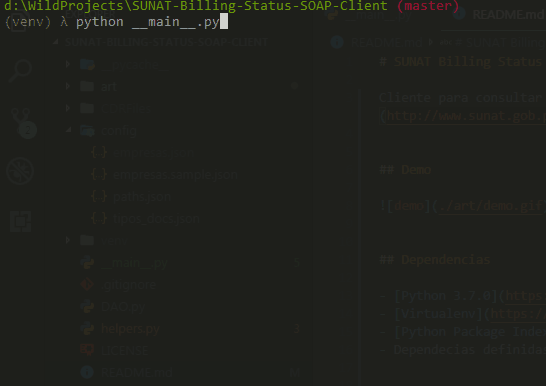

# SUNAT Billing Status SOAP Client

Cliente para consultar estado y CDR de documentos electrónicos declarados a [SUNAT](http://www.sunat.gob.pe/)


## Demo




## Dependencias

- [Python 3.7.0](https://www.python.org/downloads/release/python-370/)
- [Virtualenv](https://virtualenv.pypa.io/en/latest/)
- [Python Package Index (PyPI)](https://www.python.org/downloads/release/python-370/)
- Dependecias definidas en archivo ``requirements.txt``


## Instalación

```sh
    $ pip install -r requirements.txt
```


## Modo de Uso

- Se debe cumplir con las dependencias mencionadas.

- Ejecutar ``python __main__.py`` dentro del entorno virtual e ingresar datos solicitados.

- Argumentos opcionales:

  ``--status, -s``  Solo consultar estado de documento.

  ``--cdr, -c``     Solo consultar archivo CDR y almacenarlo según configuración.


## Configuraciones antes de ejecutar

Los archivos de configuración se encuentran dentro de la carpeta ``config/`` y son los siguientes:

``empresas.json`` Se debe crear de acuerdo al archivo ``empresas.sample.json``, este archivo es importante porque es de alli de donde se sacan los datos para la consulta SOAP, esto le permite tener una lista de empresas emisoras y poder consultar en cualquiera de ellas.


``tipo_docs.json`` contiene la lista de tipos de documentos a consultar según el [Catálogo No. 01](http://www.sunat.gob.pe/legislacion/superin/2017/anexoVII-117-2017.pdf) - Códigos Tipos de documentos


``paths.json`` contiene las rutas usadas en el sistema